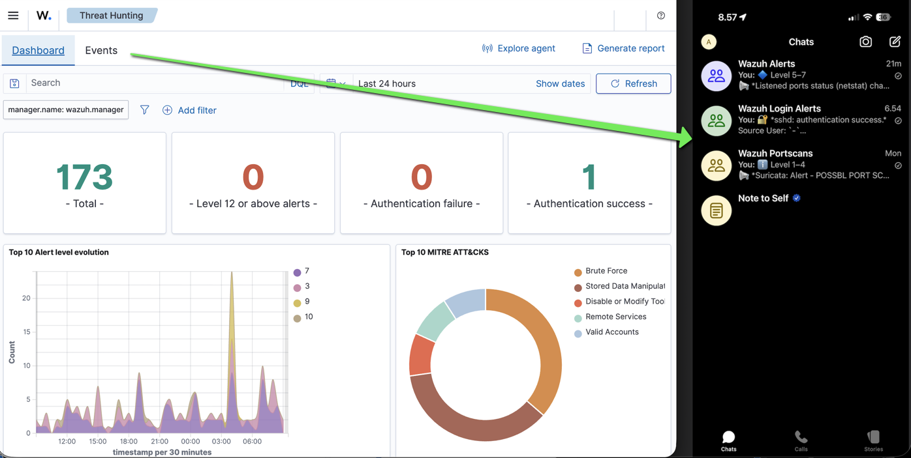

# Wazuh SIEM Alerts to Signal Messenger groups using Signal-CLI
This is a setup to automatically extract, classify, and send selected types of Wazuh alerts to Signal Messenger groups using Signal-CLI on Ubuntu.  Feel free to modify group names and other settings, credentials and file paths as needed. This project was built, tested, and deployed on an Ubuntu server 22.04.5 LTS running a default Wazuh Docker Single-Node installation v.4.13.0 (https://documentation.wazuh.com/current/deployment-options/docker/wazuh-container.html).



## Overview

## NEW: Version 1.1 (4th Dec 2025) - Fixes Signal link's time-expiration, using automated refresh for both directions, to keep the link alive. Also now throttles message rates a bit, creating a new file 'throttle_state.json'.

First, this guide prepares the installations of Signal-CLI and Signal mobile app, and also makes them work linked together to allow using the same phone number for both. Then the Wazuh API backend is prepared, and finally the included two scripts `fetch_alerts_and_send.py` and `refresh_token.sh` are made cron-repeated to continue working in the background sending alerts to Signal automatically. The scripts parse and classify Wazuh alert JSONs into three (3) different alert categories, and automatically send them into their relevant Signal chat groups, called in this project:

1. Wazuh Alerts
2. Wazuh Portscans
3. Wazuh Login Alerts

- The scripts also automatically refresh the Wazuh API token to prevent token time-outs
- Queries Wazuh alert JSONs using Elasticsearch API calls
- Runs from cron every minute and can be triggered manually (scroll further)
- Optional guide in the end: NordVPN integration with autoconnect, killswitch and LAN allow settings

NOTE: If using the same phone number for both - Signal-CLI and Signal app - the Signal group messages won't create sound alerts when received, because they are "messages from self". Using different phone numbers will enable the message sound feature. Do consider the rate of alerts though, if sound is actually desired.

### Alert Routing Logic

```
[Wazuh Docker] --> [Wazuh Alert JSONs]
                               |
                       [Python parser script using Elasticsearch API calls]
                               |
                  --> Signal Group: Wazuh Alerts [via Signal-CLI]
                  --> Signal Group: Wazuh Portscans [via Signal-CLI]
                  --> Signal Group: Wazuh Login Alerts [via Signal-CLI]
```

## Prerequisites for this guide and scripts:

* Ubuntu 22.04.3 LTS (or similar)
* Python 3.10+
* Mobile phone for Signal app + valid phone number to receive Signal's SMS verification code
* Wazuh Docker Single-Node deployment (the default setup includes Elasticsearch API), using default config port numbers - or edit ports to taste in these included scripts. Do the same with all credentials and file paths mentioned too.
* Java Runtime (for Signal-CLI - installed later just in case)

## Install basic requirements

```bash
sudo apt update && sudo apt install -y \
  openjdk-21-jre \
  python3-pip \
  unzip \
  curl \
  jq \
  qrencode \
  cron

# Install Python dependencies
pip3 install -r requirements.txt

# Verify Java Version (Must be 21 or higher)
java -version || echo "Java not found. Please install: sudo apt install openjdk-21-jre"
```

## Signal-CLI Installation (Ubuntu)

```bash
# Download and install signal-cli (tested with v0.13.20)
wget https://github.com/AsamK/signal-cli/releases/download/v0.13.20/signal-cli-0.13.20.tar.gz

# Extract it to /opt
sudo mkdir -p /opt/signal-cli && \
  sudo tar -xzf signal-cli-0.13.20.tar.gz -C /opt/signal-cli --strip-components=1

# (Optional) Remove broken symlink if it exists
sudo rm -f /usr/local/bin/signal-cli

# Link it globally for CLI use
sudo ln -s /opt/signal-cli/bin/signal-cli /usr/local/bin/signal-cli

# Test
signal-cli --version
```

1. Use web browser to open Signal's CAPTCHA generator page, and pass the test: https://signalcaptchas.org/registration/generate
2. Copy to clipboard the successful CAPTCHA URL link from the resulted "Continue/Login" button in your browser.
3. Paste the resulted URL into below command to start phone number registration process for the Signal-CLI:

```bash
signal-cli -a +44XXXXXXXXXXX register --captcha "signalcaptcha://..."
```

4. Then check the phone number for received SMS verification code.
5. Use the SMS verification code like below, and Signal-CLI should be accepted to work for that specific phone number:

```bash
signal-cli -a +44XXXXXXXXXXX verify SMS-CODE
```

## Signal Account Setup (in Mobile App)

1. Install Signal on a mobile phone, and login/register the device for that Signal account, as it usually automatically guides through.
2. Verify the phone number if needed, or otherwise - if so guided - ensure that the mobile device Signal login/registration is completed.
3. Create 3 x Signal groups named:

   * Wazuh Alerts
   * Wazuh Portscans
   * Wazuh Login Alerts

> Important: The Signal mobile app must be fully registered/logged in **before** starting the next linking process between Signal-CLI and Signal mobile app, or the following QR image reading will not go through.

## Link Signal-CLI to Mobile App

```bash
signal-cli -u +44XXXXXXXXXXX link -n "Wazuh Server"
```

That command outputs a long URL starting with `tsdevice:/`. You can visualize that url into a QR code, in a web browser (https://www.qr-code-generator.com/), or in a terminal as an ASCII image using:

```bash
echo "YOUR_TSDEVICE_LINK" | qrencode -t ansiutf8
```

Then, on your Signal mobile app, go to: Settings > Linked Devices > + > Scan the previous QR code.

Once linked successfully, check the result in Ubuntu:

```bash
signal-cli listAccounts
signal-cli -u +44XXXXXXXXXXX receive
signal-cli -u +44XXXXXXXXXXX listGroups
```

Notice the shown group ID numbers for your Signal alert group names. Replace the variable values "GROUP_GENERAL, GROUP_PORTSCAN, and GROUP_LOGIN" in the included file `fetch_alerts_and_send.py` with your actual group IDs.

## Wazuh API User Creation

We create and use a dedicated new Wazuh API user ("signalbot") to fetch alerts securely.

### Create a Wazuh Admin Token into memory with your Wazuh API credentials

```bash
ADMIN_TOKEN=$(curl -sk -u wazuh-wui:MyS3cr37P450r.*- -X POST https://localhost:55000/security/user/authenticate?raw=true)
echo $ADMIN_TOKEN
```

Replace the above mentioned default Wazuh API credentials `wazuh-wui` and `MyS3cr37P450r.*-` with your actual API credentials, if needed. (Your Wazuh credentials are listed in the default Wazuh Docker location: "wazuh-docker/single-node/docker-compose.yml".)

If the second command returned continuous mixed-char token data into terminal, the token is valid and stored in memory.

### Create New User

```bash
curl -sk -H "Authorization: Bearer $ADMIN_TOKEN" \
     -H "Content-Type: application/json" \
     -X POST https://localhost:55000/security/users \
     -d '{"username":"signalbot","password":"SomethingStrong!"}'
```

### Assign Admin Role

Find role ID number for Wazuh's user level of `administrator`, usually it's ID 1:

```bash
curl -sk -H "Authorization: Bearer $ADMIN_TOKEN" https://localhost:55000/security/roles | jq
```

Then find the user ID for the newly created user `signalbot`. Usually it's ID 100:

```bash
curl -sk -H "Authorization: Bearer $ADMIN_TOKEN" https://localhost:55000/security/users | jq
```

Replace the user ID number, and the role ID number below it, to assign Wazuh API administrator level role to that new user `signalbot`, so that it could read the Wazuh's alert JSON feed:

```bash
curl -sk -H "Authorization: Bearer ${ADMIN_TOKEN}" \
     -H "Content-Type: application/json" \
     -X PUT "${WAZUH_API}/security/users/user/100" \
     -d "{\"roles\":[1]}"
```

## Save and Configure Scripts

Save these included two scripts into your local or other desired directory, where they are allowed to run using cron. Check them for all mentioned usernames, passwords, ports, phone numbers and file paths to match your own setup.

### refresh\_token.sh

Bash script provided in the repo under `refresh_token.sh`. This script refreshes the Wazuh API admin token in memory in intervals, so that it doesn't suddenly expire and thus stop the alerts from transmitting into Signal.

### fetch\_alerts\_and\_send.py

Python script provided in the repo under `fetch_alerts_and_send.py`. This fetches the last minute of alerts, parses them, deduplicates based on similarity, and sends a single message with alert count per match.

\(Uses `HTTPBasicAuth` for Elasticsearch API access and `signal-cli` subprocess call to send.\)

### Permissions

```bash
chmod +x refresh_token.sh fetch_alerts_and_send.py
```

## Cron Setup for both scripts to work automatically

```bash
crontab -e
```

Add the scripts into cron:

```cron
* * * * * /home/user/refresh_token.sh && /usr/bin/python3 /home/user/fetch_alerts_and_send.py > /dev/null 2>&1
```

## Manual Running & Testing

```bash
bash ./refresh_token.sh && python3 ./fetch_alerts_and_send.py
```

## Troubleshooting & Debug Tools

```bash
signal-cli listAccounts
signal-cli -u +44XXXXXXXXXXX receive
signal-cli -u +44XXXXXXXXXXX listGroups
```

**Problem:** `signal-cli: command not found`  
**Solution:** Check if `/usr/local/bin/signal-cli` exists. If not, re-run the symlink step.

**Problem:** `Wazuh token expired`  
**Solution:** Ensure `refresh_token.sh` is running via cron or manually.

**Problem:** `Signal-CLI group ID not working`  
**Solution:** Run `signal-cli -u +44XXXXXXXXXXX listGroups` and verify your group ID values.

## Optional: NordVPN Setup

NordVPN is optional. If you want to route alerts through a VPN, install and configure as desired:

```bash
sh <(curl -sSf https://downloads.nordcdn.com/apps/linux/install.sh)
sudo usermod -aG nordvpn $USER && newgrp nordvpn
```

The NordVPN login process will print an URL after running the following command:

```bash
nordvpn login
```

Use a browser to visit the URL to login into NordVPN. After successful login, the NordVPN-CLI will either:

1. update itself with the accepted login information, or
2. you can use the browser's successful login page, to copy the url for the "Continue" button, and use it in the terminal like so:

```bash
nordvpn login --callback-url "https://api.nordvpn.com/..."
nordvpn account

nordvpn set technology nordlynx && \
  nordvpn set autoconnect on && \
  nordvpn set lan-discovery enabled && \
  nordvpn set routing enabled && \
  nordvpn set legacy_support enabled && \
  nordvpn set notify off
  nordvpn set killswitch off

sudo reboot
```

After reboot, VPN should be connected automatically from now on:

```bash
nordvpn status
curl ifconfig.me
```

And if not, use `nordvpn connect estonia`, etc.
